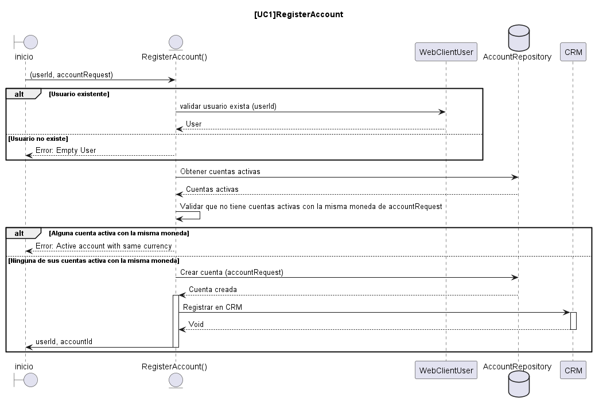

### Method: isAccountValid

Este método retorna si el usuario tienen una cuenta válida para registrar, es decir: si no tiene una cuenta en estado activo en la misma moneda que intenta registrar.

```java
private Mono<Boolean> isAccountValid(Long id, String currency) {
   ...
  }
```

- El método debe buscar en en BD con ayuda de **accountRepository**  todas las cuentas **activas** por el Userid (parámetro:*id*)
- Para que el método retorne True, ninguna de las cuentas retornadas debe coincidir con la moneda(parámetro:*curreny*)
- Si una de las cuentas retornadas coincidiera con la moneda (parámetro:*curreny*) el método debe retornar un **Business Exception**
- Puede usar el método implementado: *accountWithAnotheCurrency*


### Method: registerAccount
Este método debe registrar una cuenta de banco, para un determinado usuario, siempre que sea una cuenta válida para registrar(ver el método anterior), una vez validad, se debe registrar en BD, y a continuación registrar en CRM, una vez terminado este proceso, se debe retornar el UserId y el id de la cuenta creada.

```java
public Mono<AccountDTO> registerAccount(Long idUser, AccountRequest accountRequest) {
   ...
  }
```

- Validar que el usuario exista en la BD: usar *webClientUser.getUserFromApi*, si el usuario no existe, retornar una exception
- Validar que con las cuentas registradas del usuario : usar  *isAccountValid*
- Registrar en BD la cuenta
- Guardar en CRM
- Cuando termine el proceso de CRM, pues este puede ser lento(aprox: 3segundos ) se debe retornar la respuesta : *AccountDTO*

